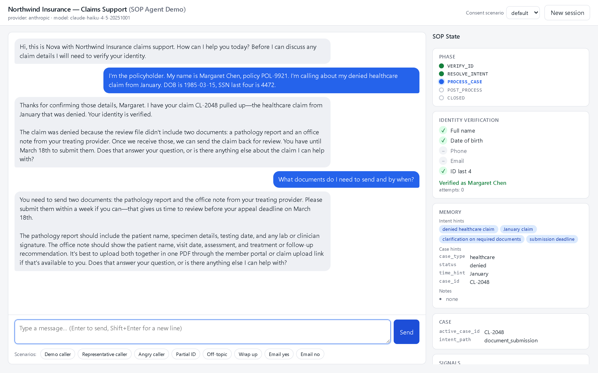
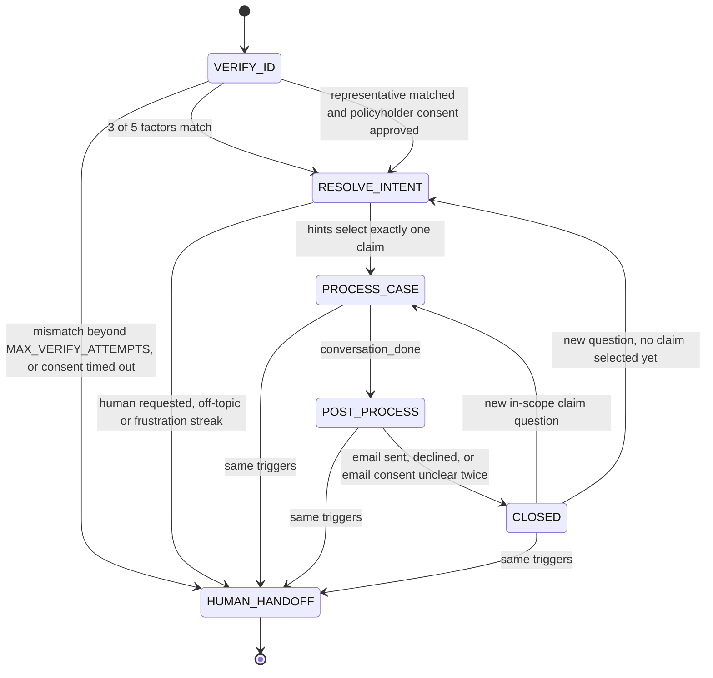

# Insurance Claims SOP Agent

A conversational insurance-claims agent where a deterministic controller enforces the procedure and the LLM only extracts and phrases.

[](https://github.com/prashant-pilla/insurance-sop-agent-harness/actions/workflows/ci.yml)
[](https://www.python.org/downloads/)
[](LICENSE)
[](#tests)



The demo caller's opening message carries three identity factors and a claim description, so one turn runs `VERIFY_ID`, `RESOLVE_INTENT` and `PROCESS_CASE` and the reply already explains the denial from the record.

## Why

Support agents built on an LLM have to do two things that pull in opposite directions: follow a fixed procedure exactly (verify identity with three factors before saying anything about a claim, resolve which claim, answer only from the record, ask before emailing) and still talk like a person. Putting the procedure in the prompt makes it negotiable; a caller can argue, inject or wear the model down. Here the procedure is Python. A controller owns phase order, the three-factor identity gate, cross-phase memory, scope and escalation rules. The model does two narrow jobs per turn: extract structured data from the caller's message, and phrase a reply from a [directive](docs/design.md#terms) the controller writes, which lists only the facts the model may use and the question it must ask. Before verification the directive carries no claim facts, so there is nothing to leak; and because only values matched against the records advance the gate, the model cannot be talked past it. It ships as a FastAPI service with a chat UI and SOP State panel, runs in Docker, and comes with 308 offline tests against a scripted fake model plus a live runner that replays thirteen conversations against a real one.

## Try it in 5 minutes

1. Configure a key: `cp .env.example .env` (`copy` on Windows), then set `LLM_API_KEY` in `.env`; for an Anthropic key also set `LLM_PROVIDER=anthropic`, for an OpenAI key the other defaults are already right. Nothing else needs editing.
2. Start the server: `docker compose up --build` (without Docker: `pip install -r requirements.txt`, then `uvicorn app.main:app`). After a first build of a minute or two, `Application startup complete` appears on port 8000, and http://localhost:8000 shows the chat window with the agent's greeting on the left and the SOP State panel on the right at phase `VERIFY_ID` with five unchecked identity factors.
   - Port 8000 busy: `APP_PORT=8010 docker compose up --build` (PowerShell: `$env:APP_PORT=8010; docker compose up --build`), or `uvicorn app.main:app --port 8010`.
   - Provider check: `GET /healthz` returns `"llm_configured": true` when a key was read from `.env`; with a wrong key or a retired model name, the first message gets a fixed notice naming the HTTP status (401, 404) and the three variables to check, and the state does not change.
3. Run the tests: `pip install -r requirements.txt` if you have not, then `python -m pytest -q`. `308 passed` in under ten seconds, with no network access and no key (the suite runs against `FakeLLM`).

Then paste this into the chat, or click the "Demo caller" preset button:

> I'm the policyholder. My name is Margaret Chen, policy POL-9921. I'm calling about my denied healthcare claim from January. DOB is 1985-03-15, SSN last four is 4472.

What happens: phase `PROCESS_CASE` after this single turn (the panel's stepper passes through `VERIFY_ID` and `RESOLVE_INTENT`), three checkmarks (name, DOB, last 4), active claim `CL-2048`, and a reply that explains the denial from the record: the review file lacked the pathology report and the treating provider office note. Then the four follow-ups:

| Say | Phase after | What happens |
| --- | --- | --- |
| What documents do I need to send and by when? | `PROCESS_CASE` | The two documents and the one-week submission guidance from the guideline file; the appeal deadline on file (2026-03-18) is in the agent's facts and usually quoted. |
| Can you email me a summary when we're done? | `PROCESS_CASE` | The panel's memory notes gain "caller asked for an emailed summary"; the outbox stays empty; the agent says it has noted the request and will offer the summary at the end. |
| That's all, thanks. | `POST_PROCESS` | The agent confirms the earlier request and still asks for a yes before sending to `m*****@email.com`. |
| Yes please send it. | `CLOSED` | One entry in the mock outbox; the "Turn debug" panel lists an `email_summary` model call next to the extractor and responder calls. |

Two more presets, one click each in a new session: "Angry caller" (phase stays `VERIFY_ID`, zero checkmarks, the reply names no claim detail) and "Representative caller" (consent request sent; the next message approves it and answers about Margaret's claim). With the server up and a key configured, `python scripts/live_demo.py` replays thirteen scripted conversations (50 caller turns) against it and checks state and wording on every turn: `PASS` on all 194 checks and exit code 0, about three minutes with Haiku. See [Scripted live check](docs/walkthroughs.md#scripted-live-check) for call counts, the check semantics and what a provider outage looks like.

## How it works



Each turn the controller runs the phase handlers (looping within one turn until a handler needs input, which is how the demo utterance crosses three phases in one reply), writes a directive, and hands it to the model; the directive is the only channel through which facts reach the responder, so how much freedom the model has is set per phase (full detail in [Architecture](docs/design.md#architecture)):

| Phase | Freedom | What the directive contains | What the LLM does |
| --- | --- | --- | --- |
| `VERIFY_ID` | Strict | Zero claim facts. `identity_verified: false`, whether the account was located, how many factors matched, which factor types are still acceptable, whether something mismatched this turn, whether to offer a human, and the mandated ask (`must_ask`, the question the reply must end with). For a representative: the names given, whether an authorization was found, the consent status and check count, never the factor list. | Phrases the ask, explains why verification exists, handles emotion. All five output guard rules can apply. |
| `RESOLVE_INTENT` | Flexible | The caller's claims as one-line briefs (case id, type, created date, status; pre-filtered deterministically by remembered hints), the hints themselves. | Confirms verification, lists or disambiguates claims. Amounts, reasons and documents are forbidden until a claim is selected. |
| `PROCESS_CASE` | Flexible but grounded | The full claim record, field descriptions from `claim_schema.json`, the guideline entries from `required_document_guideline.json` that match the claim (required documents with their descriptions and accepted alternatives, follow-up guidance entries matched by `intent_path` and the caller's wording, and the guideline's fallback text for uncovered questions), the caller's other claims. | Answers freely within the facts, handles follow-ups, confirms claim switches. Must not invent anything. |
| `POST_PROCESS` | Email consent gate | Masked on-file email, active claim, the remembered email preference if any. | Offers the summary as a yes/no question (confirming an earlier request rather than asking cold when one was made), declines other addresses, explains why consent is needed if asked. A yes sends a three-part summary (what was discussed, claim status or outcome, next steps); no closes; an unclear answer is re-asked once, then the session closes without sending. |
| `CLOSED` | Minimal | Nothing new. | Brief warm close; a new claim question reopens `PROCESS_CASE`. |
| `HUMAN_HANDOFF` | Terminal | Reason and verified flag. | One acknowledgement plus the transfer message, no questions. Later messages get a fixed queue reply without calling the model. |

The key mechanisms, one line each:

- Directive: the controller's per-turn instruction to the responder (`phase`, `goal`, `facts`, `must_ask`, `instructions`, `forbidden`, `tone`, `fallback_text`); before verification it carries zero claim facts, so there is nothing to leak. [Terms](docs/design.md#terms), [Architecture](docs/design.md#architecture).
- Output guard: five string and regex rules scan the draft before the caller sees it, `claim_leak`, `false_status`, `unstated_mismatch`, `missing_human_offer` and `wrong_factor_count`; a violation triggers one regeneration with a correction, then the templated fallback. [Output guard](docs/design.md#output-guard).
- Cross-phase memory: intent hints, case hints, the intent path and the email preference are stored in any phase and used later, which is how "denied healthcare claim from January", said while unverified, resolves `CL-2048` without re-asking. [Memory across phases](docs/design.md#memory-across-phases).
- Scope and emotion streaks: consecutive off-topic turns, and frustrated turns without progress, offer a human and then hand off at `MAX_OFF_TOPIC` and `MAX_FRUSTRATION_TURNS`; emotion changes the tone and never relaxes a gate. [Scope](docs/design.md#scope), [Emotion](docs/design.md#emotion).
- Representative consent: a caller on the policyholder's behalf is matched against `representatives.json` and waits for simulated policyholder consent, which replaces the three factors; the policyholder's factors recited by a representative never verify. [Representative consent flow](docs/design.md#representative-consent-flow).
- PII redaction: only the extractor sees the raw message; the stored transcript, both model history windows, the traces and the email draft check use `[EMAIL]`, `[PHONE]`, `[DATE]`, `[ID4]`, and the raw values live only in `state.slots`, never returned by the API. [PII handling](docs/design.md#pii-handling).

Two more properties worth knowing: the identity gate cannot be talked past because only extracted values matched against the records advance it ([Injection resilience](docs/design.md#injection-resilience)), and a model or provider failure produces a templated reply with the state unchanged ([Failure handling](docs/design.md#failure-handling)).

## Design decisions

- The policy number locates the account but is not one of the five identity factors.
- Email summaries go only to the address on file, shown masked (`m*****@email.com`); caller-supplied addresses are declined. Delivery is a mock outbox in session state.
- General insurance questions are answered briefly as labeled general guidance with an offer of a human, rather than refused.
- Thresholds (`MAX_VERIFY_ATTEMPTS`, `MAX_OFF_TOPIC`, `MAX_FRUSTRATION_TURNS`) are configuration, not hard-coded behaviour.
- English only.
- Representatives are supported because the data model includes `representatives.json` and `consent_scenarios.json`, and since the representative record carries no PII the gate is the policyholder's consent rather than a second identity check. A representative is matched on their own name and the policyholder's name against `representatives.json`; the stated relationship is recorded, not matched. Consent is simulated from `consent_scenarios.json` and advances one step per caller turn; the policyholder's factors supplied by a representative never verify.
- All six fixture files are used: `policyholders.json`, `claims.json`, `claim_schema.json` and `required_document_guideline.json` for the policyholder path, `representatives.json` and `consent_scenarios.json` for the representative path. The last two are loaded tolerantly (a deployment without them still serves policyholders), which is what the [Tests](docs/design.md#tests) section calls "optional".
- The extractor's `intent_path` (denial question, status inquiry, document submission, next steps, appeal, general) selects which follow-up guidance entries reach the responder; it does not branch the workflow, because every intent is answered from the same claim record inside `PROCESS_CASE`.
- Identity attempts are counted internally and never announced; after the human offer, one further mismatching attempt transfers the caller without a warning turn.
- The server stores only the redacted transcript, so after a page reload your own messages show `[DATE]`, `[PHONE]`, `[EMAIL]` and `[ID4]` where you typed identity values.
- The email summary has three sections (what was discussed, the claim status or outcome, the next steps), enforced by the drafter prompt and by a templated fallback with the same three parts.
- `POST_PROCESS` is entered when the extractor reports that the caller is wrapping up (`conversation_done`), not at a fixed point after an answer; a caller who keeps asking stays in `PROCESS_CASE`.
- "From January" matches the month of a claim's `created_at` in any year unless a year is stated. Margaret has two January claims (`CL-2048`, 2026, denied; `CL-2011`, 2025, closed), so "January" alone would produce a disambiguation question; the demo's `denied` and `healthcare` hints narrow it to one.

## Configuration

All settings come from environment variables (a `.env` in the repo root is loaded automatically). Provider behaviour (JSON mode fallback, timeouts, retries) is under [Provider notes](docs/walkthroughs.md#provider-notes).

| Variable | Default | Notes |
| --- | --- | --- |
| `LLM_PROVIDER` | `openai` | `openai` (OpenAI or any OpenAI-compatible chat-completions host) or `anthropic`. |
| `LLM_API_KEY` | none | Required to talk to a model. The only mandatory setting. |
| `LLM_MODEL` | `gpt-4o-mini` / `claude-haiku-4-5-20251001` | Default depends on the provider. If the provider returns HTTP 404, the default has been retired; set an available model here. |
| `LLM_BASE_URL` | `https://api.openai.com/v1` / `https://api.anthropic.com` | For OpenAI-compatible hosts, the base that precedes `/chat/completions`: OpenRouter `https://openrouter.ai/api/v1`, vLLM `http://host:8001/v1`, Ollama `http://host:11434/v1`. Azure OpenAI needs an OpenAI-compatible gateway in front of it (the raw Azure endpoint uses `api-version` and `api-key`). |
| `MAX_VERIFY_ATTEMPTS` | `3` | Identity turns containing a mismatch before the agent offers a human (a turn with several mismatched values counts once). One further mismatching turn transfers to a human automatically, so with the default the transfer happens on the fourth; see [Identity](docs/design.md#identity-3-of-5-factors). |
| `MAX_OFF_TOPIC` | `3` | Consecutive off-topic turns before `HUMAN_HANDOFF` (from the second, the responder is instructed to offer a human). |
| `MAX_FRUSTRATION_TURNS` | `3` | Consecutive frustrated/angry/refusing turns without progress (no new matched factor, no phase change, no in-scope claim answer) before `HUMAN_HANDOFF`. |
| `TRACE_ENABLED` | `true` | Per-turn debug trace in the API response, the UI "Turn debug" panel and `traces/<session_id>.jsonl`. Identity values in the extraction are masked; see [Tracing](docs/design.md#tracing). |

## Project layout

```
app/
  main.py                 FastAPI: session and message endpoints, /healthz, static UI
  config.py               Settings from environment / .env
  llm/                    LLMClient interface, OpenAI-compatible and Anthropic clients, factory
  sop/                    controller (per-turn loop), extractor, responder, redact, guard, prompts, state, trace, phases/
  tools/                  Fixture store (identity, representatives, consent, claims, guidance) and mock email outbox
  static/                 index.html, app.js, style.css (chat + SOP State panel)
apps/insurance_claims/fixtures/   Data: policyholders, claims, claim schema, document guidance, representatives, consent scenarios
scripts/live_demo.py      Scripted live scenarios with PASS/FAIL checks (needs a running server and a key)
tests/                    FakeLLM suite (no network)
docs/                     design.md, walkthroughs.md, behaviour-spec.md, transcripts.md, media/
Dockerfile, docker-compose.yml, .dockerignore, requirements.txt, pyproject.toml, .env.example
```

The per-file tree and the API shapes are in [Project layout](docs/design.md#project-layout) and [API shapes](docs/design.md#api-shapes).

## Tests

`python -m pytest -q`: 308 tests, no network, no key, under ten seconds; `tests/conftest.py` defines `FakeLLM`, whose extractor returns scripted JSON keyed by substrings of the caller's message and whose responder echoes the directive, so tests assert on exactly what the model was permitted to say. Live, with a server and a key: `python scripts/live_demo.py` (thirteen scenarios, 194 checks). What each test file covers: [Tests](docs/design.md#tests).

## Development

`requirements.txt` is the install path; `pyproject.toml` holds the project metadata and the pytest configuration. CI (`.github/workflows/ci.yml`) runs the test suite on every push and pull request and builds the Docker image. Licensed under [MIT](LICENSE).

## Documentation

- [docs/design.md](docs/design.md): terms, the per-turn loop and phases, how each gate works (identity, memory, scope, emotion, output guard, injection, failures, PII), the representative consent flow, design decisions, project layout, API shapes, tracing, per-file test coverage.
- [docs/walkthroughs.md](docs/walkthroughs.md): setup options (Compose, plain Docker, local Python), provider notes, the four preset walkthroughs with expected behaviour, the scripted live check runner.
- [docs/behaviour-spec.md](docs/behaviour-spec.md): every rule the agent enforces, each with where it is implemented, which unit test pins it, which live scenario shows it, and where the docs explain it.
- [docs/transcripts.md](docs/transcripts.md): real model output from the live runs, with commentary on the lines that read like SOP violations.

## Roadmap

- Real consent delivery for representatives (SMS or portal to the policyholder's verified contact) replacing the simulated `status_sequence`, plus consent scope and expiry on the record and representative PII once the fixtures carry it.
- Grounding check on `PROCESS_CASE` replies: verify that any amount, date or document name in the reply appears in the directive facts, and regenerate otherwise (a post-verification rule for the output guard).
- Split the generic harness (controller loop, directive model, guard, tracer, phase protocol) from the insurance-specific phases and fixtures so other SOPs can reuse it.
- LLM-simulated caller evaluations: drive many persona variations through `scripts/live_demo.py`-style checks to measure gate and disclosure behaviour statistically.
- Persistence and multi-worker deployment: move sessions out of process memory.
- Voice front end; the responder already targets short, single-question turns for that reason.
