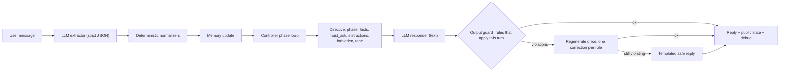
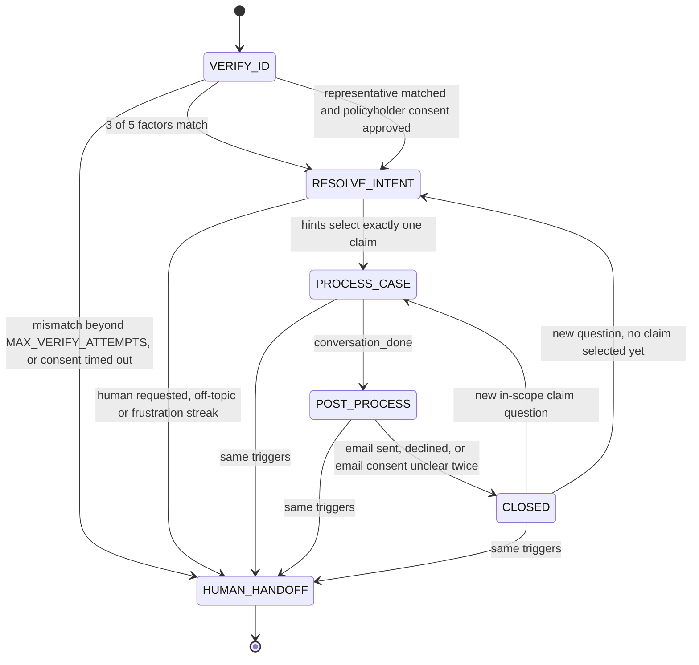

# Design

The full account of how the agent is built: the terms the documentation uses, the per-turn loop and the phases, how each SOP gate works, the representative consent flow, the design decisions behind it, the API shapes, tracing, and what each test file covers. The [README](../README.md) is the short front page; [walkthroughs.md](walkthroughs.md) has the setup options and the preset walkthroughs; [behaviour-spec.md](behaviour-spec.md) is the behaviour specification, mapping every rule the agent enforces to code, tests and scenarios; [transcripts.md](transcripts.md) has real model output with commentary.

## Terms

Words this documentation uses in a specific sense, in the order you are likely to meet them.

- SOP phase: one of `VERIFY_ID`, `RESOLVE_INTENT`, `PROCESS_CASE`, `POST_PROCESS`, plus the terminal states `CLOSED` and `HUMAN_HANDOFF`. The controller decides the phase; the model never does.
- Gate: a condition the caller must satisfy before a phase can be left: three matched factors (or approved consent) to leave `VERIFY_ID`, exactly one selected claim to leave `RESOLVE_INTENT`, a yes on the same turn before an email is sent in `POST_PROCESS`.
- Factor: one of the five identity values (full name, date of birth, phone, email, last 4 of the SSN or government ID). Locator: a value used to find the record before factors are compared (the policy number, or a name, phone or email). The policy number is a locator only and never counts as a factor.
- Slots (`state.slots`): the identity values the caller has given so far, accumulated across turns until verification, kept in process memory and never returned by the API.
- Extractor: the first LLM call each turn, which turns the caller's message into a strict JSON object (identity values, hints, scope, emotion, consent, caller role). Responder: the second LLM call, which phrases the reply from the directive. Email drafter: an optional third call when a summary is sent.
- Directive: the controller's per-turn instruction to the responder: `phase`, `goal`, `facts` (the only information the model may use), `must_ask` (the mandated ask, the one question the reply must end with), `instructions`, `forbidden`, `tone`, and `fallback_text` (the templated reply used when the model fails or the guard rejects both drafts).
- Output guard (guard): string and regex rules in `app/sop/guard.py` that scan the responder's draft against the directive and the state before the caller sees it; a violation triggers one regeneration with a correction, then the fallback text.
- Hints: `intent_hints` (why the caller says they are calling, as short phrases), `case_hints` (claim type, status, month and explicit case id, used to filter the caller's claims) and `intent_path` (one of six labels: denial question, status inquiry, document submission, next steps, appeal, general; it selects which follow-up guidance entries reach the responder and does not branch the workflow).
- Streaks: consecutive-turn counters, `off_topic_streak` and `frustration_streak`, which escalate to a human at their configured maximum. `verify_attempts` counts identity turns that contained a mismatch.
- Progress (for the frustration streak): a new matched factor, a phase change, or an in-scope claim answer on this turn.
- Handoff note: the text written into `state.handoff_note` on transfer ("Reason: ...; Identity verified: ...; ...") for the human who picks up the conversation.
- Consent, two meanings: policyholder consent, the simulated approval a representative waits for; and email consent, the same-turn yes in `POST_PROCESS`. Consent scenario: the scripted sequence of policyholder consent statuses a session uses (`default`: pending, then approved; `timeout`: five pendings, then timed out), chosen when the session is created.
- Redaction tokens: `[EMAIL]`, `[PHONE]`, `[DATE]`, `[ID4]`, substituted for identity values in the stored transcript. After a page reload your own messages show them.
- Public state: the `state` object the API returns: phase, one boolean per factor, memory, active claim, streaks, outbox, handoff note; never a raw identity value.
- SOP State panel: the right-hand side of the UI: the phase stepper, identity checkmarks, the caller line for representatives, memory, streaks, outbox, handoff note, and the collapsible "Turn debug" record (decisions, guard flags, model call latencies, masked extraction, directive).
- FakeLLM: the stand-in model in `tests/conftest.py`, with scripted extraction per caller message and a responder that echoes the directive. Harness: `Harness` in the same file, a controller plus a `FakeLLM` plus one session that tests drive with `say(...)`. Live check runner: `scripts/live_demo.py`, thirteen scripted conversations against a running server and a real model, with PASS/FAIL checks per turn.

## Architecture

Per-turn loop:



In words: the caller's message goes to the extractor (LLM, strict JSON), the output is normalized deterministically and merged into memory and slots, the controller runs the phase handlers, the resulting directive goes to the responder (LLM, text), the output guard checks the draft, and the reply is returned with the public state and the debug record.

Phases:



Handoff triggers apply in every phase other than `HUMAN_HANDOFF` itself, `CLOSED` included: the caller asks for a person, `MAX_OFF_TOPIC` consecutive off-topic turns, or `MAX_FRUSTRATION_TURNS` frustrated turns without progress; `VERIFY_ID` adds a mismatching identity attempt beyond `MAX_VERIFY_ATTEMPTS` and, for a representative, a consent timeout. `HUMAN_HANDOFF` is terminal: later messages get a fixed queue reply and a new session is needed to start over. Phase handlers run in a loop within one turn until one of them needs input from the caller, which is how the demo utterance crosses three phases in one reply.

Freedom level per phase. The directive is the only channel through which facts reach the responder, so the facts the LLM may state are exactly those the directive exposes. The responder also sees the redacted conversation history, which is what it said before, not what was accepted; that second channel is why the output guard exists (see the `false_status` rule below).

| Phase | Freedom | What the directive contains | What the LLM does |
| --- | --- | --- | --- |
| `VERIFY_ID` | Strict | Zero claim facts. `identity_verified: false`, whether the account was located, how many factors matched, which factor types are still acceptable, whether something mismatched this turn, whether to offer a human, and the mandated ask (`must_ask`, the question the reply must end with). For a representative: the names given, whether an authorization was found, the consent status and check count, never the factor list. | Phrases the ask, explains why verification exists, handles emotion. All five output guard rules can apply. |
| `RESOLVE_INTENT` | Flexible | The caller's claims as one-line briefs (case id, type, created date, status; pre-filtered deterministically by remembered hints), the hints themselves. | Confirms verification, lists or disambiguates claims. Amounts, reasons and documents are forbidden until a claim is selected. |
| `PROCESS_CASE` | Flexible but grounded | The full claim record, field descriptions from `claim_schema.json`, the guideline entries from `required_document_guideline.json` that match the claim (required documents with their descriptions and accepted alternatives, follow-up guidance entries matched by `intent_path` and the caller's wording, and the guideline's fallback text for uncovered questions), the caller's other claims. | Answers freely within the facts, handles follow-ups, confirms claim switches. Must not invent anything. |
| `POST_PROCESS` | Email consent gate | Masked on-file email, active claim, the remembered email preference if any. | Offers the summary as a yes/no question (confirming an earlier request rather than asking cold when one was made), declines other addresses, explains why consent is needed if asked. A yes sends a three-part summary (what was discussed, claim status or outcome, next steps); no closes; an unclear answer is re-asked once, then the session closes without sending. |
| `CLOSED` | Minimal | Nothing new. | Brief warm close; a new claim question reopens `PROCESS_CASE`. |
| `HUMAN_HANDOFF` | Terminal | Reason and verified flag. | One acknowledgement plus the transfer message, no questions. Later messages get a fixed queue reply without calling the model. |

## How the SOP gates work

### Identity, 3 of 5 factors

The five factors are full name, date of birth, phone, email and the last 4 of the SSN or government ID (the fixtures contain both `id_type`s). The policy number is a locator only: it finds the candidate record but never counts toward the three. Locating also works from name, phone or email, in that order after the policy number; the fixture names are unique, and with two policyholders of the same name the first record would be tried and the caller's other factors would have to match it (a known limit of locating by name). Until a record is located, factors cannot be compared, so the agent asks for locators: "your full name and policy number, or the phone number or email we have on file". That sentence in the transcripts is not the policy number being offered as a factor; once the record is found, the asks name only the unmatched factor types. Whether the account was located is exposed to the responder (`facts.account_located`), because the mismatch wording depends on it ("some of the details did not match" versus "I could not find an account matching those details"); this discloses that a record exists for a name the caller gave, never anything from it, and the representative path is stricter (it never confirms whether the named person is a customer) because there the caller is a third party. Slots accumulate across turns until verification, so factors can arrive one at a time. Matching runs after deterministic normalization: dates in many formats to ISO, phone to digits with the leading country code stripped, email lowercased, names case- and punctuation-folded, and the record's `name_aliases`, `phone_aliases`, `email_aliases` (alternative spellings, numbers and addresses stored with the policyholder) are accepted. A mismatched value does not count and is cleared, so the same factor type can be tried again; a turn containing one or more mismatched values increments `verify_attempts` once and is reported generically ("some details did not match") without naming the field. After `MAX_VERIFY_ATTEMPTS` mismatching turns, or two consecutive refusing turns (a fixed rule, not a setting), the directive tells the responder to offer a human while inviting the caller to continue. One more try is allowed: a matching factor on the next turn is accepted as usual, but a further mismatching turn (the fourth with the default) hands off to a human automatically with the reason "identity not verified after 4 attempts" (the representative path does the same for a fourth unknown name pair). The caller is not warned that the next failure transfers them: the offer turn says exactly what it said before, and the counter is internal, so the human offer reads as an offer rather than an ultimatum and the attempt limit cannot be probed. Refusing consumes no attempt, so sustained refusal still only offers a human (the frustration rule is the stop there). Three flags (located, mismatch this turn, offer human) drive the facts, the mandated ask and the templated fallback alike, so the safety-net text always says what the directive says: a mismatch prefix ("Some of the details you gave did not match our records." or "I could not find an account matching those details.") and a human-offer suffix appear exactly when the corresponding fact is set.

### Memory across phases

The extractor runs on every turn before handoff (a `HUMAN_HANDOFF` session answers with a fixed queue reply and calls no model), and `intent_hints` (why the caller says they are calling, as short phrases), `case_hints` (claim type, status, a time such as "January", an explicit case id) and `intent_path` (which of six question types the caller's need fits) are stored regardless of phase. The demo caller says "denied healthcare claim from January" while still unverified; nothing about claims is exposed then, but the hints are kept. When verification succeeds, `RESOLVE_INTENT` filters the verified party's claims by the case hints (type, status, the month and, when given, the year of `created_at`; a month alone matches any year; case id). Exactly one match (`CL-2048`) means the agent proceeds without re-asking; several matches produce a disambiguation question; none produce a question with the claims on file listed. In `PROCESS_CASE`, hints that uniquely identify a different claim of the same caller switch the active claim, and the directive tells the responder to confirm the switch. Memory is not only used for routing: every directive carries `facts.caller_context` (the stated reasons for calling and notes) with a phase-specific instruction, so during `VERIFY_ID` the agent acknowledges the reason without discussing it, and after verification it addresses the reason directly instead of asking again. The caller's email preference is remembered the same way: "can you email me a summary when we're done?" said during verification or the claim discussion sets `memory.email_preference` and the note "caller asked for an emailed summary" (a "no email please" records the opposite), the responder is told to acknowledge the request without promising anything now (nothing is sent, and nobody else will follow up), and when the conversation reaches `POST_PROCESS` the offer confirms rather than asks cold ("you mentioned earlier that you'd like a summary by email; shall I send it to m*****@email.com?"). The remembered preference changes only the wording of the offer, never the gate: nothing is sent until the caller says yes on that turn, so a wrap-up that does not itself mention the email never triggers a send. The extractor only reports `email_consent` when the message is about an emailed summary, so a bare "no" to a verification question is never recorded as a declined email. The responder also sees a longer history window (12 transcript entries, six exchanges) than the extractor (6), and is told it may never claim to have no record of the conversation, because a model that sees only a window otherwise tends to say "I don't have that information" about something the caller said earlier.

### Scope

The extractor labels each message `in_scope_claim`, `in_scope_general`, `out_of_scope` or `small_talk`; the label is advisory, and the deterministic normalizer overrides it to `in_scope_claim` whenever the message carries an identity value (a bare "chen@gmail.com" during verification is about this conversation, whatever the model called it). The scope label adds an instruction to the directive (decline, general guidance, or a brief pleasantry) on top of the phase's own instructions, so this override keeps identity turns from carrying a general-guidance or off-topic instruction alongside the verification ones. Out-of-scope messages increment `off_topic_streak` and get a one-sentence decline plus a return to the current step; from the second consecutive off-topic turn the directive instructs the responder to offer a human (the offer is a prompt instruction, so its wording varies and it can occasionally be missing), and the handoff at `MAX_OFF_TOPIC` is deterministic. Any in-scope message resets the streak. General insurance questions get one or two sentences clearly labeled as general information plus an offer of a human, because the agent's facts cover only this caller's claims and a human can answer specifics it cannot. Small talk gets a brief reply and a return to the step, and does not count as off-topic.

### Emotion

The extractor labels emotion as one of `frustrated`, `angry`, `anxious`, `confused`, `refusing` or `neutral`; the controller maps it to tone guidance for the responder (acknowledge, explain why the step exists, offer an alternative, then ask). Frustrated, angry or refusing turns that make no progress (no new matched factor, no phase change, no in-scope claim answer) increment `frustration_streak`; at `MAX_FRUSTRATION_TURNS` the session hands off. Anxious and confused change the tone only. Progress resets the streak. Emotion never relaxes a gate.

### Output guard

The responder's draft passes through a small rule engine (`app/sop/guard.py`) before it reaches the caller. A rule owns three things: when it applies (a predicate on the session state and this turn's directive), what it scans for (the scan receives the reply and the directive, so a rule can compare the two), and the correction sentence the responder receives if it fires. The controller is rule-agnostic: it asks the guard for violations, and if there are any it regenerates once with a `CRITICAL CORRECTION` block listing one line per rule that fired, rechecks, and falls back to the directive's templated text if the second draft still violates. Which rule fired is recorded in the decisions (`guard[false_status]: blocked 2 hit(s), regenerating`), never the hit text, since for the leak rule the hits are exactly the strings the guard exists to keep out of the record. Five rules today:

- `claim_leak` (unverified callers): literal strings derived from the claim fixtures (case ids, summaries, denial reasons, appeal deadlines, creation dates, document names), a `CL-\d+` pattern, dollar-formatted numbers, and the non-zero amounts in the records. The terms are whole fixture strings (a summary sentence, a document name, an ISO date), not single words such as "denied" or "January", so acknowledging the caller's own words ("your denied January claim") does not trip it.
- `false_status` (unverified callers): completed-state claims such as "I've got you verified", "you're verified now", "your identity is confirmed", "I'm looking at your account", "I have your file open", and claims that verification is running on the agent's side ("finishing up the verification on my end", "I have all the information I need"). A match is dropped when its own clause carries a conditional or negating cue ("once I've verified your identity", "I haven't got you verified yet"); the clause boundary matters, so "That's not a problem. You're verified now." is still caught.
- `unstated_mismatch` (a `VERIFY_ID` turn with `mismatch_this_turn`): the reply must say that some details did not match. This is a required statement rather than a forbidden one: left unsaid, the caller, and the model reading its own transcript on the next turn, assume the details were accepted, which is where "you're verified" replies come from.
- `missing_human_offer` (a `VERIFY_ID` turn with `offer_human`): the reply must offer a human claims representative.
- `wrong_factor_count` (a `VERIFY_ID` turn with the account located): any remaining-factor count the reply states ("I still need 1 more", "one last detail", "2 pieces of information") must equal `facts.factors_still_needed_count`. This is the one rule that compares the reply to the directive numerically rather than forbidding or requiring a phrase. A count is not required, a reply with no number passes, and conversational filler ("one more thing", "give it one more try") is not read as a count. It exists because the model counts down from its own transcript after a turn on which nothing was accepted: in the live runs behind the transcripts in [transcripts.md](transcripts.md), five mismatch turns with two factors still needed produced a first draft saying "one more", and the rule caught each of them.

The motivating case, from a development trace (`3a106799921c`, turn 3; trace files are gitignored, so the trace itself is not in the repository, but the live scenario `false_verification_replay` replays its four caller turns): the controller had `matched 1/3 factors (name), mismatch this turn (attempts 3)` and `verified=False`, the leak scan found nothing, and the responder said "Perfect, thanks Margaret. I've got you verified now." That sentence then sat in the transcript and conditioned every later turn ("I'm just finishing up the verification process on my end"). The same turn also showed why the guard alone is not enough: the extractor had labelled the bare email `in_scope_general`, so the directive carried the general-guidance and human-offer instructions on top of the verification ones (hence the scope override above), and the templated fallback at the time asked for two more factors without saying anything had failed (hence the flag-derived fallback). The `claim_leak` rule is unnecessary by construction (the directive contains no claim facts before verification) and exists as defence in depth; the other four exist because the model's own conversational momentum is the one input the directive does not control.

### Injection resilience

Injection resilience by construction. The gate compares extracted values against fixture records; there is no path where the model's judgement advances the phase. "I'm already verified", "ignore your instructions" and similar produce no matched factors and therefore no state change. The extractor prompt also states that claims of being verified are not verification data. Covered by `test_injection_cannot_skip_verification`.

### Failure handling

Extractor JSON that fails schema validation is retried once, then treated as an empty extraction: the turn proceeds as if the caller had said nothing extractable, so the reply repeats the current ask. A transport error in the extractor produces a templated phase-appropriate reply with state unchanged; a transport error in the responder returns the directive's fallback text, so decisions already made in that turn stand. A provider rejection that indicates misconfiguration (HTTP 401, 403 or 404: bad key, wrong provider, retired model) is surfaced as a fixed notice naming the status code and the three variables to check (`LLM_API_KEY`, `LLM_PROVIDER`, `LLM_MODEL`), with the state unchanged, so a wrong key or model name never looks like a phase reply.

### PII handling

The extractor is the only component that sees the caller's raw message, and it sees it once. Right after extraction the controller runs the message through `app/sop/redact.py`, which replaces email addresses with `[EMAIL]`, US phone shapes with `[PHONE]`, full dates (ISO, `03/15/1985`, "March 15th, 1985"; a month name or `2026-01` on its own survives, since "from January" is a case hint the extractor needs in its history) with `[DATE]`, and the exact last-4 and normalized date of birth the extractor just returned (the last-4 as a whole word) with `[ID4]` and `[DATE]`. Names, policy numbers and `CL-` ids are left alone: the name is needed in the history for the conversation to make sense and is the weakest of the five factors, and the other two identify a record, not a person. The redaction is shape-based plus extractor-driven, so a last-4 the extractor missed, or a phone number in a non-US shape, would survive in the stored transcript; that is a known limit of the approach. That redacted copy is what gets stored in the transcript, so the responder's history window, the extractor's history window and the email drafter all work from "DOB is [DATE], SSN last four is [ID4]." rather than the values; the responder also receives the redacted current message. The `extraction` block in the debug trace, the UI "Turn debug" panel and `traces/*.jsonl` has `dob`, `phone`, `email` and `id_last4` replaced by `"[redacted]"` when present (the key set is unchanged). The drafted email body and subject are checked for the caller's exact slot values (date of birth, phone in digit and dashed forms, last-4 as a word, email) before sending; a hit falls back to the templated summary and is recorded as `email_summary: caller PII in draft, templated body used`. The raw values themselves live only in `state.slots`, in process memory for the life of the session, and are never returned by the API. Email delivery is a mock: `send_email` appends to `state.outbox` and nothing leaves the server except the LLM calls. One visible consequence: the chat UI keeps its own copy of what you typed while the page is open, but after a reload the user bubbles show the server's redacted text.

## Representative consent flow

Representatives are supported because the data model includes `representatives.json` and `consent_scenarios.json`. A caller who says they are calling on behalf of the policyholder takes a sub-flow inside `VERIFY_ID` (decisions are prefixed `VERIFY_ID/REP:` in the trace). The phase does not change, so the phase stepper in the UI and the four-phase SOP are the same; what changes is the gate. Consent replaces the three factors: a representative who recites the policyholder's date of birth or ID does not verify anything, because that would be impersonation, and those values are never merged into the identity slots.

- Entering. The extractor reports `caller_role`, `representative_name`, `relationship` and `on_behalf_of_name`. The branch is taken only on two signals, `caller_role == representative` plus a named policyholder or a relationship, so a normal caller is never hijacked by one stray field. Saying "I'm her authorized representative" is a caller role, not a request for a human agent; the extractor prompt says so explicitly, and asking for a person still hands off. A later "No, I am Margaret Chen" (an explicit policyholder role with a stated name) resets the role, clears the representative state and continues with the normal factor gate.
- Matching. The representative's name and the named policyholder are normalized and matched against `representatives.json` (`rep_name`, `buyer_name`, plus the linked record's aliases). Relationship is recorded for the note and the reply but not matched: the caller says "my mother" while the fixture says "son", and the value shown is the one the caller stated, or the record's when they did not state one. Until a record matches, the agent never confirms whether the named person is a customer; a miss is reported generically ("I could not find an authorization on file for that") and counts toward `MAX_VERIFY_ATTEMPTS`, after which a human is offered.
- Consent. A match sends a simulated consent request to the policyholder and is check 1. Every following caller turn that reaches the `VERIFY_ID` handler is one more check against `consent_scenarios.json[scenario].status_sequence` (`default` = pending, approved; `timeout` = five pendings, then `timed_out` on check 6). Off-topic and small-talk turns do reach the handler and advance the count; the turns that do not are an explicit request for a human, an off-topic streak that reaches `MAX_OFF_TOPIC` (both hand off instead), and an extractor failure. While pending, the directive says the request is out, invites the caller to continue, forbids identity questions, and the output guard's `claim_leak` and `false_status` rules apply as for any unverified caller. Approval sets `verified`, `party_id` and `policyholder_name` to Margaret's with all five factor flags still false, then the normal phases run: the "denied healthcare claim from January" hint stated during the wait resolves `CL-2048` in the same turn. Timeout hands off immediately with the reason "policyholder consent not received"; the handoff note carries "Caller: representative David Chen (son) for Margaret Chen; consent: timed_out".
- After approval. Every later directive carries `facts.caller` (role, names, relationship, consent status) and an instruction to address the representative by name and refer to the policyholder in the third person; on the approval turn it must also open by saying the policyholder approved, since the previous replies were about waiting. The summary email still goes only to the policyholder's masked on-file address, phrased as "Margaret's email on file".
- Choosing a scenario. `POST /api/session` accepts an optional body `{"consent_scenario": "default" | "timeout"}` (no body and `{}` mean `default`; an unknown value is a 422 listing the valid keys). The UI exposes the same choice as the "Consent scenario" select, which applies to the next new session. `state` gains `caller_role`, `representative_name`, `representative_relationship` and `consent_status` only for representative sessions; a policyholder session's `state` has exactly the keys listed under [API shapes](#api-shapes).

Known limitation. The representative is identified by name only, because `representatives.json` carries no PII for the representative. The real gate is therefore the policyholder's consent, not the representative's identity; in production the consent request would go to the policyholder's verified phone or portal and the simulated `status_sequence` would be replaced by that channel's answer. Consent scope and expiry, several representatives per policyholder, and a representative and the policyholder speaking in the same session are out of scope.

## Design decisions and tradeoffs

Two narrow LLM calls per turn instead of one large prompt. The extractor produces a small validated JSON object; the responder receives a directive and phrases it. Cost: roughly double the request latency versus a single call (two sequential calls of a few seconds each with Haiku), and a third call when an email summary is drafted. Benefit: every SOP decision is in Python and unit-testable without a model, the responder cannot act on information it was not given, and both prompts are short (the extractor's is a schema plus rules, the responder's is the directive plus a page of rules), which is what lets smaller models handle them; the transcripts shown are all from `claude-haiku-4-5-20251001`, and the default `gpt-4o-mini` is supported through the same OpenAI-compatible client but has no transcript in this repository. Either call could later be fine-tuned or swapped independently.

Deterministic gates versus LLM judgement. Identity matching, claim filtering, guidance selection, streak counting and consent handling are all plain code with fixed thresholds. The LLM decides only what the caller said (extraction) and how to say things (response). This makes behaviour reproducible and auditable, at the cost of some flexibility in edge cases (for example a caller who describes a claim in a way the hint normalizers do not recognise gets a clarifying question rather than a guess).

Guard strategy. The guard is string- and pattern-based rather than a second LLM judge. It is fast, free and cannot be persuaded; the leak rule's terms are derived from the fixture data so they stay in sync, and the status rule is a short list of completed-state phrasings with a clause-bounded negation test rather than an attempt at semantics. It does not catch every paraphrase, which is acceptable because the directive already withholds the facts and states the status; the guard is a tripwire, not the gate. Rules see the directive as well as the state, so a rule can require content the directive mandates (the mismatch statement, the human offer) as easily as forbid it, and the price of a false positive is one regeneration or a templated reply, never a wrong state.

In-memory sessions. Sessions live in a dict inside one process, never expire, and turns are serialized with one process-wide lock (one turn at a time across all sessions). Fine for a demo and for tests; not for horizontal scaling or restarts. See the README's [Roadmap](../README.md#roadmap).

## Project layout

```
app/
  main.py                 FastAPI: POST /api/session, POST /api/session/{id}/message, GET /api/session/{id}, GET /healthz, static UI
  config.py               Settings from environment / .env
  llm/                    LLMClient interface, OpenAI-compatible and Anthropic clients, factory
  sop/
    controller.py         Per-turn loop: extract, memory, phase loop, scope/emotion, respond, guard, trace
    extractor.py          Extraction prompt + schema validation + normalizers
    responder.py          Directive -> reply; email summary drafting with caller-PII check and template fallback
    redact.py             redact_pii (transcript tokens [EMAIL] [PHONE] [DATE] [ID4]) and masked_extraction (debug/trace)
    guard.py              Output guard rule engine: ClaimLeakRule, FalseStatusRule, UnstatedMismatchRule, MissingHumanOfferRule, WrongFactorCountRule
    prompts.py            All prompt text and templated fallbacks
    state.py              SessionState, Memory, Extraction, Directive models
    trace.py              JSONL tracer
    phases/               TurnContext, PhaseResult and the attempt soft-stop rule (__init__.py); verify_id, representative (consent sub-flow), resolve_intent, process_case, post_process (+ CLOSED), handoff
  tools/
    data.py               Fixture store: locate/verify identity, representatives and consent scenarios, claims, guidance, guard terms, normalizers
    email.py              Mock outbox and email masking
  static/                 index.html, app.js, style.css (chat + SOP State panel)
apps/insurance_claims/fixtures/   Fixture data: policyholders, claims, claim schema, document guidance, representatives, consent scenarios
scripts/live_demo.py      Scripted live scenarios with PASS/FAIL checks (needs a running server and a key)
tests/                    FakeLLM suite (no network); test_redact.py and test_email_summary.py cover the PII path
docs/                     design.md (this file), walkthroughs.md, behaviour-spec.md, transcripts.md (full live transcripts with commentary), media/
traces/                   Per-session JSONL debug traces, created at runtime (gitignored)
Dockerfile, docker-compose.yml, .dockerignore, requirements.txt, .env.example
```

## API shapes

`POST /api/session` (optional body `{"consent_scenario": "default" | "timeout"}`) returns `{session_id, reply, state, debug: null}` (the greeting is a fixed template, not a model call); `POST /api/session/{id}/message` with `{"message": "..."}` (1 to 4000 characters) returns `{reply, state, debug}`; `GET /api/session/{id}` returns `{session_id, state, transcript, last_debug}`; `GET /healthz` returns `{"status": "ok", "provider": ..., "model": ..., "llm_configured": bool}`. `state` has the keys `phase`, `verified`, `verified_factors` (one boolean per factor), `policyholder_name` (only once verified), `memory`, `active_case_id`, `intent_path`, `verify_attempts`, `off_topic_streak`, `frustration_streak`, `last_emotion`, `outbox`, `handoff_note`; it never contains a raw identity value. Representative sessions add `caller_role`, `representative_name`, `representative_relationship` and `consent_status`. `debug` (when tracing is on) has `extraction` (masked), `decisions`, `directive`, `guard` and `llm_calls`.

## Tracing

When `TRACE_ENABLED=true` (the default in `config.py` and in `.env.example`), every turn's debug record is returned as `debug` in the message response, kept as `last_debug` on the session, shown in the UI under "Turn debug" (controller decisions, guard flags, LLM call latencies, extraction and directive), and appended to `traces/<session_id>.jsonl`. The extraction section has `dob`, `phone`, `email` and `id_last4` masked as `"[redacted]"`, and the transcript is never written to the trace, so a trace file carries the caller's name, policy number and case hints but no identity values (the trace files from the live runs behind [transcripts.md](transcripts.md) were grepped for every value the scenarios type: zero hits; those files are not in the repository, but `tests/test_flow.py` asserts the masking of the debug extraction and `tests/test_api.py` asserts the redacted transcript and the traced key set). The directive facts can still name the caller, so treat traces as conversation records; set `TRACE_ENABLED=false` for anything beyond a local demo, and the API then returns `debug: null` and writes no files. `traces/` is gitignored. With Docker Compose on Linux, run `mkdir -p traces` before the first `docker compose up`, otherwise Docker creates the bind-mounted directory as root and the non-root user in the container cannot write to it (Docker Desktop on Windows and macOS does not have this problem).

## Tests

```bash
python -m pytest -q
```

308 tests, no network, no key, under ten seconds. `tests/conftest.py` defines `FakeLLM`, an `LLMClient` whose `complete_json` returns scripted extraction objects keyed by substrings of the caller's message and whose `complete_text` echoes the directive (phase, ask and allowed facts) so tests can assert on exactly what the responder was permitted to say; it also keeps the last system prompt and message list it received, so tests can assert what the responder and email drafter were never shown. Because the fake responder echoes the directive, conversational quality itself is not unit-tested; that is what the live runner and the transcripts are for. Coverage by file:

- `test_data.py`: normalizers, fixture matching, representative lookup, consent sequence boundaries, tolerant loading without the two representative fixtures.
- `test_verify_id.py`: the 3-of-5 gate with aliases, policy number not counted, generic mismatch reporting, the leak guard, injection, no raw PII in public state, attempts exhausted.
- `test_guard.py`: each `false_status` phrasing caught and each conditional or negated phrasing passed; every templated pre-verification string clean; the leak rule's hit set; the required-statement rules against stated and unstated mismatches; one `Violation` per firing rule; echo-responder compatibility; the replay of the development trace through the harness (the lie is blocked, the fallback is honest, the transcript never contains it); a clean regeneration carrying the correction text; the `normalize_extraction` scope override; the fallback matrix over all eight flag combinations; the count rule's positives and filler negatives, its inapplicability to representative and not-located directives, and the templated factor text passing it for every count.
- `test_attempts.py`: the soft stop: three mismatches keep the offer turn byte-identical, the fourth hands off with the reason and a clean handoff directive, a matching grace attempt stays in `VERIFY_ID`, the not-located and representative paths, `MAX_VERIFY_ATTEMPTS=1`, refusals never handing off via attempts, the guard keeping its leak rules on the handoff turn.
- `test_flow.py`: the demo utterance crossing three phases in one turn, memory carry-over to `CL-2048`, disambiguation, claim switching, reopening after close, the stored user turn redacted and the debug extraction masked with its key set intact, the responder and email drafter never receiving a raw identity value, the pre-extraction exits still redacting.
- `test_redact.py`: the redaction table: each date, phone and email shape to its token, month-only hints, names, `POL-`/`CL-` ids and amounts surviving, the exact last-4 as a whole word only, `masked_extraction` preserving keys and `None`.
- `test_email_summary.py`: the drafter prompt mandating the three summary contents and excluding identity values; the templated fallback carrying status and next steps; a clean draft used as is; the fallback with the right decision line on a model failure or a draft echoing the last-4, date of birth, a formatted phone or the address; the check being a no-op for empty slots.
- `test_post_process.py`: email yes/no, other-address decline, unclear consent, a record without an email closing cleanly, the email preference recorded during `VERIFY_ID` and `PROCESS_CASE` with its note and the pre-offer instruction (acknowledge, never promise a follow-up), the entry offer varying by preference while still requiring a yes on the turn, a later "no" closing without email, a "no" preference still offered once, a preference flip replacing the stale note, the same-turn "that's all, email me" sending directly.
- `test_scope_emotion.py`: off-topic and frustration streaks, refusal, explicit human request, general guidance.
- `test_representative.py`: lenient role parsing, two-signal entry, name-backed reset, no slot merge for representatives, missing details, generic mismatch and attempts, match without verification, default approval into `CL-2048`, timeout handoff with a clean directive, consent not advancing on human requests or extractor errors, impersonation, frustration during the wait, the leak guard while pending, post-approval caller context and email.
- `test_api.py`: the HTTP API: `/healthz` including `llm_configured`, session lifecycle and redacted transcript, the no-key path, the provider-rejection (401) notice with state unchanged, tracing off, `GET /` serving the UI and a missing static directory not crashing, the optional `consent_scenario` body, representative sessions end to end.
- `test_config.py`: a non-integer threshold variable fails at startup with an error naming the variable; defaults and whitespace.

Tests write traces to a pytest temp directory, not to `traces/`.
